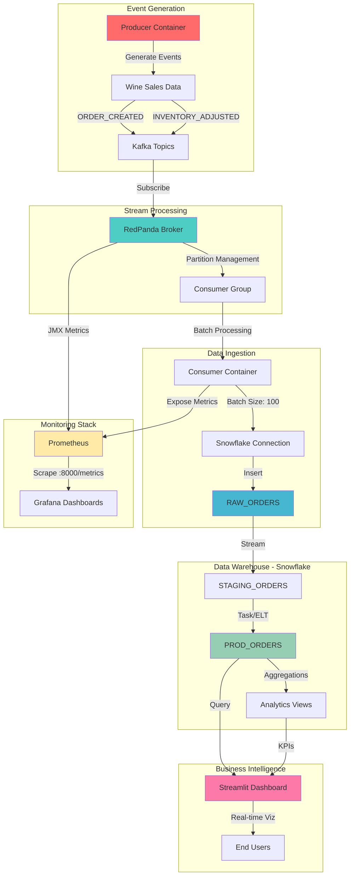
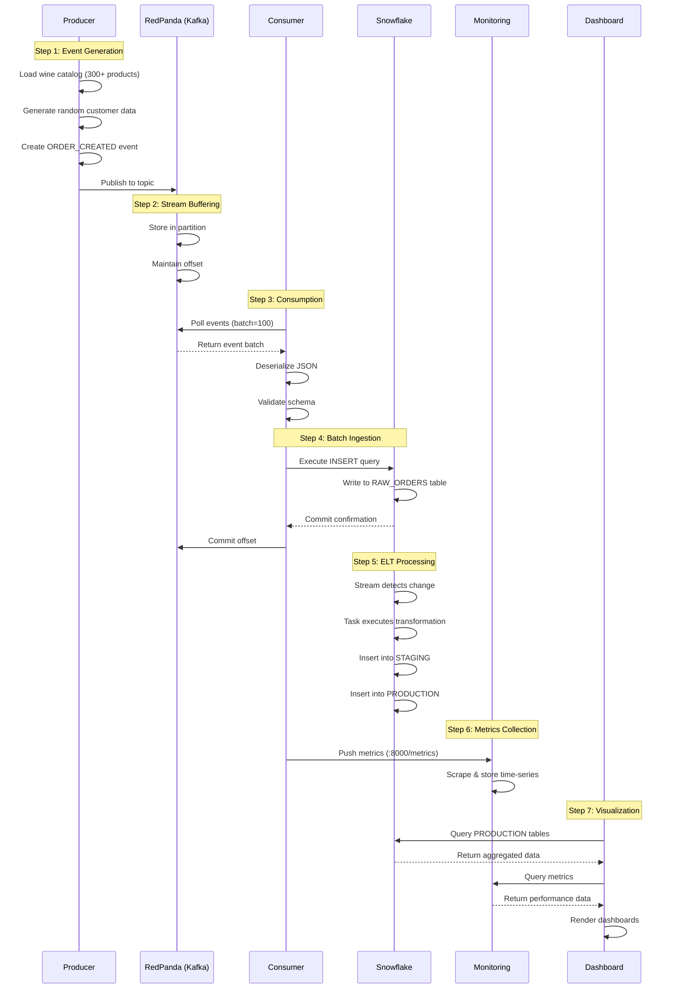
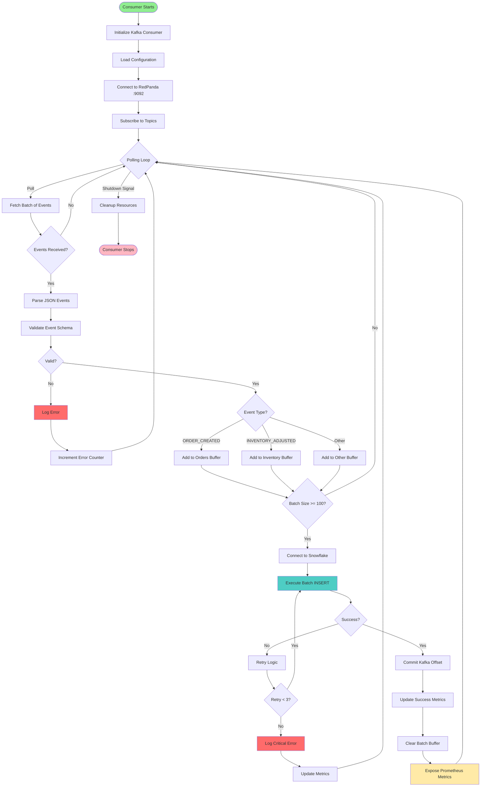
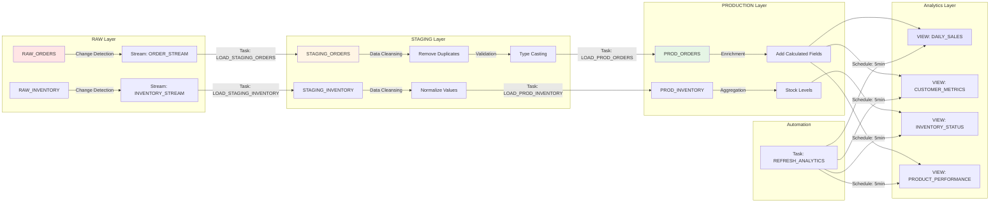
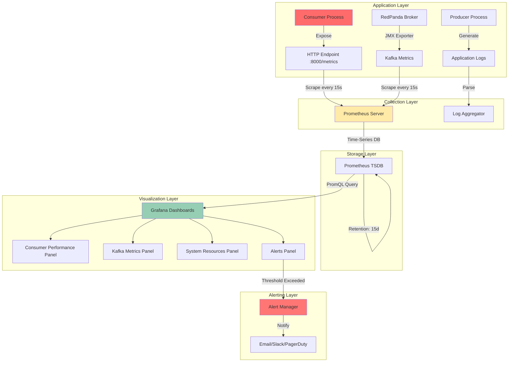
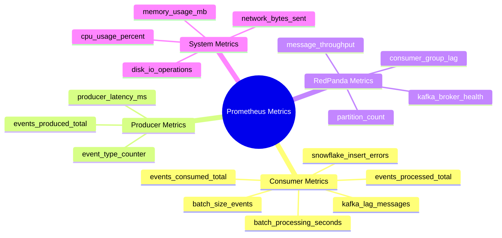
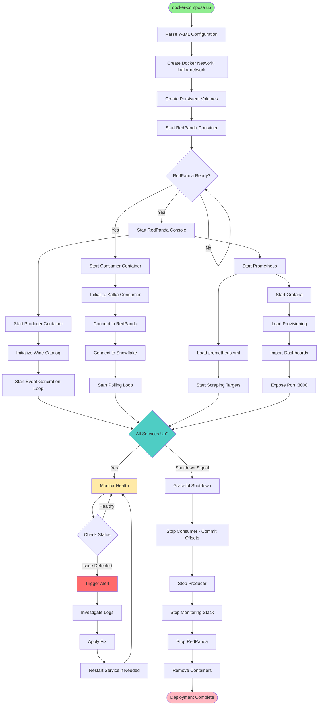

```mermaid
graph LR
    A[Source: Producer] -->|Raw Events| B[Bronze: RAW Schema]
    B -->|Stream Detection| C[Silver: STAGING Schema]
    C -->|Business Logic| D[Gold: PRODUCTION Schema]
    D -->|Aggregations| E[Platinum: Analytics Views]
    E -->|Visualization| F[End User: Dashboard]
    
    style A fill:#8B4513
    style B fill:#CD7F32
    style C fill:#C0C0C0
    style D fill:#FFD700
    style E fill:#E5E4E2
    style F fill:#00CED1
```

# 🔄 Process Schema - Les Caves d'Albert Event Streaming Pipeline

This document provides comprehensive visual schemas outlining all the steps and processes in the wine sales event streaming system.

---

## 📊 Table of Contents

1. [High-Level Architecture](#1-high-level-architecture)
2. [Data Flow Pipeline](#2-data-flow-pipeline)
3. [Event Processing Steps](#3-event-processing-steps)
4. [Snowflake Data Transformation](#4-snowflake-data-transformation)
5. [Monitoring & Observability](#5-monitoring--observability)
6. [Deployment Process](#6-deployment-process)

---

## 1. High-Level Architecture

---

## 2. Data Flow Pipeline

### Complete End-to-End Process

---

## 3. Event Processing Steps

### Detailed Consumer Processing Flow

---

## 4. Snowflake Data Transformation

### ELT Pipeline in Snowflake

### Snowflake Task Execution Schedule

```mermaid
gantt
    title Snowflake Tasks Execution Timeline
    dateFormat HH:mm
    axisFormat %H:%M
    
    section Data Ingestion
    Consumer Batch Insert (RAW) :active, raw1, 00:00, 3m
    Consumer Batch Insert (RAW) :raw2, 00:05, 3m
    Consumer Batch Insert (RAW) :raw3, 00:10, 3m
    
    section Staging Tasks
    LOAD_STAGING_ORDERS :staging1, 00:03, 2m
    LOAD_STAGING_INVENTORY :staging2, 00:03, 2m
    LOAD_STAGING_ORDERS :staging3, 00:08, 2m
    LOAD_STAGING_INVENTORY :staging4, 00:08, 2m
    
    section Production Tasks
    LOAD_PROD_ORDERS :prod1, 00:05, 2m
    LOAD_PROD_INVENTORY :prod2, 00:05, 2m
    LOAD_PROD_ORDERS :prod3, 00:10, 2m
    LOAD_PROD_INVENTORY :prod4, 00:10, 2m
    
    section Analytics Refresh
    REFRESH_ANALYTICS :analytics1, 00:07, 1m
    REFRESH_ANALYTICS :analytics2, 00:12, 1m
```

---

## 5. Monitoring & Observability

### Metrics Collection Flow

### Key Metrics Exposed

---

## 6. Deployment Process

### Docker Compose Orchestration

---

## 📋 Process Summary

### Step-by-Step Execution

| Step | Component | Action | Duration | Output |
|------|-----------|--------|----------|--------|
| 1 | **Producer** | Generate wine sales events | Continuous | JSON events |
| 2 | **RedPanda** | Buffer events in topics | Real-time | Partitioned messages |
| 3 | **Consumer** | Poll and batch events | ~3s/batch | 100 events buffered |
| 4 | **Consumer** | Validate and parse JSON | <100ms | Structured data |
| 5 | **Consumer** | Insert batch to Snowflake RAW | ~2-3s | RAW_ORDERS populated |
| 6 | **Snowflake Stream** | Detect new records | Real-time | Change data capture |
| 7 | **Snowflake Task** | Transform RAW → STAGING | 1-5min | STAGING_ORDERS populated |
| 8 | **Snowflake Task** | Transform STAGING → PROD | 1-5min | PROD_ORDERS populated |
| 9 | **Prometheus** | Scrape metrics endpoint | Every 15s | Time-series data |
| 10 | **Grafana** | Query and visualize metrics | Real-time | Dashboard refresh |
| 11 | **Streamlit** | Query production tables | On-demand | BI analytics |

---

## 🔍 Data Lineage

---

## ✅ Process Validation Checklist

- [x] **Event Generation**: Producer generates realistic events with French wine data
- [x] **Stream Buffering**: RedPanda manages topics and partitions
- [x] **Batch Processing**: Consumer processes 100 events per batch
- [x] **Data Validation**: Schema validation before Snowflake insertion
- [x] **ELT Pipeline**: Automated transformation through RAW → STAGING → PRODUCTION
- [x] **Monitoring**: Real-time metrics exposed to Prometheus
- [x] **Visualization**: Grafana dashboards display pipeline health
- [x] **Analytics**: Streamlit dashboard queries production data
- [x] **Error Handling**: Retry logic and error logging implemented
- [x] **Observability**: Comprehensive logging at each step

---

**Document Version**: 1.0  
**Last Updated**: October 19, 2025  
**Author**: Mory Junior MEITE  
**Project**: Les Caves d'Albert - Event Streaming Pipeline
